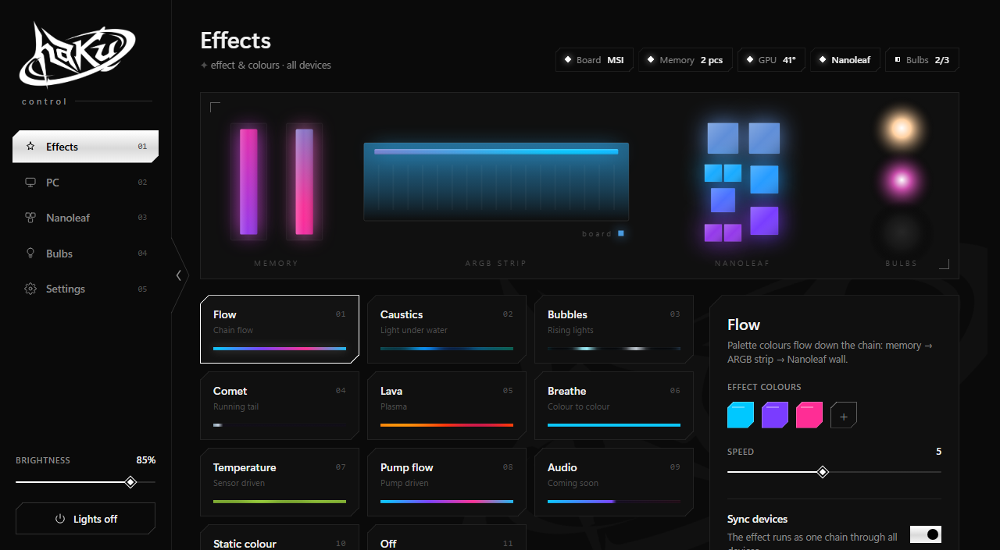

# haku control

One lighting scene for your PC **and** your room. haku control drives the RGB inside the case
(motherboard ARGB header, memory) and the lights on the wall (Nanoleaf, Wi-Fi bulbs) from a single
effect engine: colours flow from the RAM sticks through the water block onto the wall, or every
device runs its own effect.



- **Scene-based effects:** flow, caustics, bubbles, comet, lava, breathe, temperature and static.
  Each device can follow the main effect or run its own, with its own palette, colour or white (2700–6000 K).
- **Light on resources:** a small C core in the tray (~0.05 % CPU, a few MB of RAM). Unchanged frames are
  never sent. The settings window (WebView2) exists only while it is open.
- **Behaves like a light switch:** switching a device off in the app really turns it off. When the PC shuts down or sleeps,
  the room lights go dark (or keep / restore their own state, as you choose).
- **Local only:** no account, no cloud, no telemetry. Devices are controlled over USB, SMBus and your LAN.
- English and Russian UI.

> **Status: early.** haku control grew out of one person's setup, so the list of supported devices is
> short. Adding more is the main goal of the next releases (see the [roadmap](#roadmap)).
> Help with devices you own is very welcome: see [CONTRIBUTING.md](CONTRIBUTING.md).

## Supported devices

| Device | How | Status |
| --- | --- | --- |
| MSI Mystic Light: onboard LED + JRAINBOW1 ARGB header | USB HID, 185-byte protocol | verified on MPG B650I EDGE WIFI (MS-7D73); other boards are not touched |
| ENE DRAM RGB, controller `AUDA0-E6K5-0101` (e.g. G.Skill Trident Z5 RGB) | SMBus via [PawnIO](https://pawnio.eu), AMD chipsets | verified; other controllers are detected and left alone |
| Nanoleaf Blocks / Shapes / Canvas / Lines | official OpenAPI + UDP streaming | Blocks verified |
| AiDot Wi-Fi bulbs (e.g. Linkind / "Matter Smart Light Bulb") | local LAN protocol, keys fetched once | verified with RGBTW bulbs |
| NVIDIA GPU temperature (for the temperature effect) | NVML | verified |

The app only writes to hardware it has positively identified. It never writes to the memory controller's
flash or changes SMBus addresses, and it restores each device's own effect when it exits.

## Install

Requirements: Windows 10/11 x64, [WebView2 Runtime](https://developer.microsoft.com/microsoft-edge/webview2/)
(built into Windows 11), and [PawnIO](https://pawnio.eu) for memory lighting.

1. Download the latest release zip and unpack it.
2. In an **elevated** PowerShell 7, run `scripts\install.ps1`.
   This copies the app to `C:\Program Files\haku-control` and adds a logon task that starts it with admin rights.
   The rights are needed for SMBus and HID access.
3. Click the tray icon to open the window.

Settings, device keys and the log live in `%APPDATA%\haku-control`. To remove the app, run
`scripts\uninstall.ps1` (add `-Purge` to delete the settings too).

### Room lights

- **Nanoleaf:** open the Nanoleaf tab, press *Pair*, then hold the controller's power button for 5–7 s.
- **AiDot bulbs:** run `pwsh -File "C:\Program Files\haku-control\aidot-setup.ps1"` once. It logs in to your
  AiDot account (the password goes only to AiDot and is not stored) and saves each bulb's local key. After that,
  everything runs locally.
- **Lights on the PC's own Wi-Fi (optional):** *Settings → Windows hotspot* keeps the Windows Mobile Hotspot
  running, so lights can join a network that exists whenever the PC is on.

## Build

Needs Visual Studio 2019 or newer (or Build Tools) with *Desktop development with C++* and a Windows 10/11 SDK.

```bat
build.cmd
```

Output goes to `bin\`. For UI work without the app, serve `ui\` with any static server and open
`index.html?mock`, for example `python -m http.server -d ui 8766`. The mock fakes the core with sample data.

### Layout

```
src/        C core: main loop, effects, device drivers, WebView2 window (ui_web.cpp)
ui/         settings page (HTML/CSS/JS, no framework), i18n.js holds all texts
res/        icons and version info
art/        logo sources and the icon generator
scripts/    install / uninstall / stop, AiDot key setup
third_party WebView2 SDK loader, PawnIO SMBus module
```

## Roadmap

1. ~~Open source, CI builds, settings in `%APPDATA%`.~~
2. First-run wizard: find devices in the PC and on the network.
3. Device plugins: OpenRGB SDK bridge (hundreds of PC devices), Philips Hue, WLED, Govee LAN, Yeelight, LIFX,
   more Mystic Light boards and ENE versions.
4. Installer, signed builds, auto-update. Phone control from the local network.

## License

Code: [MIT](LICENSE). The **haku** name and logo (`art/`, `ui/haku.png`, `ui/mark.svg`, `res/*.ico`) are not
covered by the MIT license. Please don't use them for other projects or forks you distribute.
Third-party components are listed in [THIRD_PARTY_NOTICES.md](THIRD_PARTY_NOTICES.md).

Not affiliated with MSI, G.Skill, ENE, Nanoleaf, AiDot or NVIDIA; their names are used only to describe compatibility.
